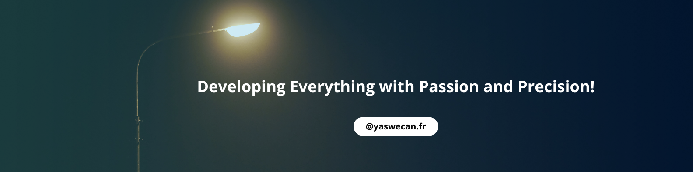

<h1>Welcome To YasWeCan's Profile</h1>

<code></code>

###   **What's my current role in tech?** </h2>
       { SoftWare Engineer | DevOps } 

#### Connect with me 

#### About
Here are some basic things to know about YasWeCan 😎;

- 🔭 I’m currently working majorly with Javascript and Typescript,
- 🌱 I’m currently exploring Frontend Web development, Mobile App development Open source,
- 📫 How to reach me: Email: yacinelahjaily@gmail.com.
- 😄 Pronouns: He/Him/His,
- ⚡ Fun fact: I love Reading articles📖 and writing ✍.

#### My Core Languages
<code></code>
<code></code>
<code></code>
<code></code>
<code></code>

#### Frameworks/Libraries I Use
<code></code>
<code></code>
<code></code>

#### Tools I Use
<code></code>
<code></code>
<code></code>
<!-- <code></code> -->
<code></code>
<code></code>
             
